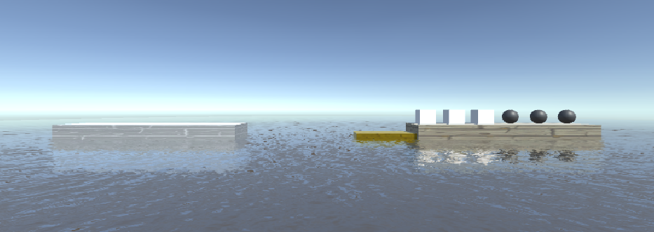
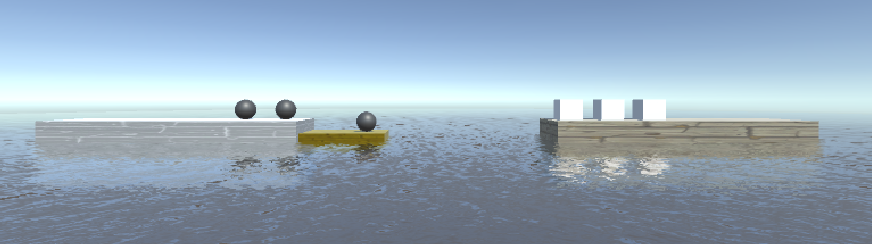
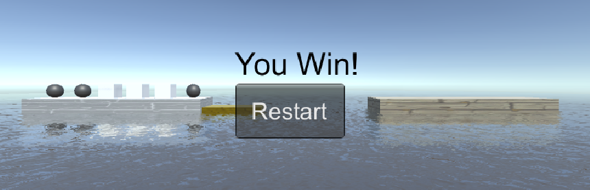

# unity3d 牧师与魔鬼

* 游戏视频 [https://www.bilibili.com/video/av68529228](https://www.bilibili.com/video/av68529228)

## 基本概括

* 游戏规则
  * 让3个牧师和3个魔鬼都渡过河；
  * 船每次最多能装 2 个人，且船上至少有一人才能移动。
  * 在任意一侧同时有牧师和魔鬼时，如果牧师数量少于魔鬼的数量时（该侧岸上和该侧船上），魔鬼就会攻击牧师，游戏结束。
  * 所有牧师和魔鬼都到对岸时，游戏成功。
* 游戏中提及的事物（Objects）
  * 3 个牧师
  * 3 个恶魔
  * 2 河岸
  * 1 条船
  * 河/海

* 玩家动作表

|      玩家动作       |    作用对象     |          触发条件          | 产生效果       |
| :-----------------: | :-------------: | :------------------------: | -------------- |
| 点击岸上的牧师/恶魔 |    牧师/恶魔    | 船靠在此岸边，且船上有空位 | 牧师/恶魔上船  |
| 点击船上的牧师/恶魔 |    牧师/恶魔    |                            | 牧师/恶魔上岸  |
|      点击船身       |       船        |  船上至少有一个牧师/恶魔   | 船往另一头移动 |
| 点击**Restart**按钮 | **Restart**按钮 |         游戏结束时         | 重新开始游戏   |

* 游戏截图

  * 开始

    

  * 进行中

    

  * 成功

    

* 游戏视频

## 游戏架构

* 游戏使用了 MVC 架构。
* `Model`由场景中的所有`GameObject`构成，它们由一些基本的`Controller`控制：
  * `MyCharacterController`类控制牧师和魔鬼；
  * `BoatController` 类控制船；
  * `CoastController` 类控制河岸。
* `View` 为 `InteractGUI` 和 `ClickGUI`，提供与玩家交互的界面，比如展示游戏结果，提示玩家重新开始。
* `Controller`：`MyCharacterController`、`BoatController`、`CoastController` 对游戏对象直接控制，在本游戏中更高一层的 `Controller` 是 `FirstController` 。`FirstController` 管理着这个场景中的所有对象，协调游戏对象（预制件级别）之间的通讯，以及对外部输入事件进行响应。
  最高层的`Controller` 是 `SSDirector` 类，一个游戏中只能有一个实例，它控制着场景的创建、切换、销毁、游戏暂停、游戏退出，管理游戏全局状态等。

* `Interface`，本游戏的接口定义在命名空间`Interfaces`中，interface不能直接用来创建对象！必须先有一个类实现它，本游戏`FirstController` 类继承实现了它。