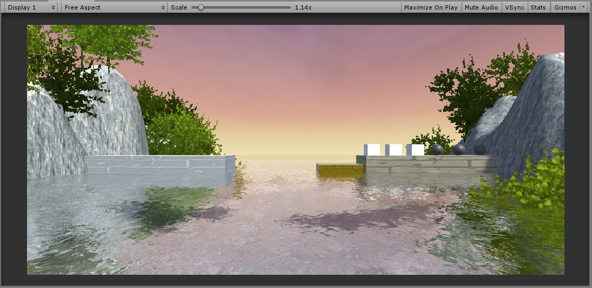

游戏视频地址 https://www.bilibili.com/video/av70560042

# 游戏对象与图形基础

## 1. 基本操作演练

### 下载  Fantasy Skybox FREE， 构建自己的游戏场景

* **下载资源** 从 Asset Store 中搜索 `Fantasy Skybox Free` ，下载后导入资源。

* **制作天空盒**
  * 选择 6 张图片加入到 Assets 中，可以直接选择从 Assets Store 中下载的。
  
  * 创建一个 material，命名为 `Sky`，将它的 Shader 修改为 Skybox/6 Sides，按方位导入 6 张图片。
  
  * 在 Tint Color 中着色。
  
  * 改变 Exposure  的值，可以调整曝光度。
  
    <left></left>
  
  * 制作好 Sky.mat 材料后，选中 Camera，Inspector 面板中点击 Add Component -> Rendering -> Skybox，然后将 Sky.mat 拖入选择框中。
  
* **创建地形** 创建一个 Terrain 对象，然后在 Terrain 的 Inspector 窗口进行操作（我使用的是 2019 版本的 Unity，界面可能会不太一样）。
  
  <left></left>
  * 第一个添加相邻的 Terrain。
  
  * 第二个按钮能实现造山，刷纹理，磨平等功能；如选中 `Raise or Lower Terrain`后，在 Brushes 中选择刷子，按住鼠标左键，就可以在 Terrain 上刷山，按住 shift 键，是逆向操作，将恢复山地为平地。
  
    <left></left>
  
  * 第三个按钮用来刷树。
  
  * 第四个按钮可以绘制细节，一般用于刷草。
  
  * 最后一个按钮是 Terrain 的整体设置。
  
* 整合场景
  
  * 为摄像机添加天空盒组件：菜单栏 Component ->  rending -> skybox -> 加入之前创建的 skyBox 组件
  
    <left></left>
  
* 添加了天空盒和 Terrain 的魔鬼与牧师运行界面

  <left></left>

### 写一个简单的总结，总结游戏对象的使用

游戏对象可以是游戏中人物、道具、场景等对象。它只包含一些基础的属性没有具体的功能，是组件的容器，而组件实现了具体的游戏功能。

在 Unity3d 中，开发者可以为游戏对象添加 C#/JavaScript 脚本，这样，挂载了脚本的游戏对象就有了具体的功能。这些功能可以是动态的行为，也可以是游戏对象的外观、位置上的各种表现。所以，有了组件的游戏对象才是有灵魂的游戏对象。

## 2. 编程实践 牧师与魔鬼-动作分离版

[github传送门](https://github.com/LeoBarwoo/Unity3d/tree/master/3-PriestsAndDevils-V2)