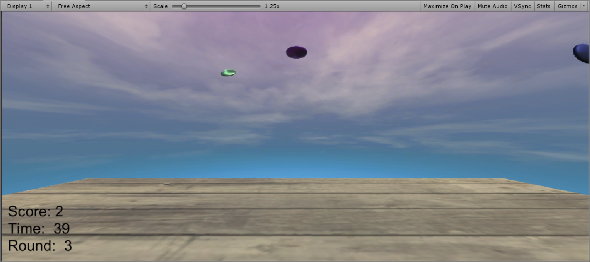

# Unity3d - 打飞碟

## 编写一个简单的鼠标打飞碟（Hit UFO）游戏

- 游戏内容要求：
  1. 游戏有 n 个 round，每个 round 都包括10 次 trial；
  2. 每个 trial 的飞碟的色彩、大小、发射位置、速度、角度、同时出现的个数都可能不同。它们由该 round 的 ruler 控制；
  3. 每个 trial 的飞碟有随机性，总体难度随 round 上升；
  4. 鼠标点中得分，得分规则按色彩、大小、速度不同计算，规则可自由设定。
- 游戏的要求：
  - 使用带缓存的工厂模式管理不同飞碟的生产与回收，该工厂必须是场景单实例的！具体实现见参考资源 Singleton 模板类
  - 近可能使用前面 MVC 结构实现人机交互与游戏模型分离


## 实现

* 效果图如下（视频链接 [https://www.bilibili.com/video/av70691799](https://www.bilibili.com/video/av70691799)）

  

* [github 传送门](https://github.com/LeoBarwoo/Unity3d/tree/master/4-HitUFO)

* 同样，本次的游戏和之前一样，需要包含 `SSDirector` ， `CCDirector`，`SSAction` ， `SSActionManager`，`CCMoveToAction`，`InteractGUI`，`Interfaces` 这些基本框架组件。另外新增的类为 `Disk` 和 `DiskFactory`。

* `Disk` 类

  * 包含一些基本属性，方便在运动过程中取值和赋值。使用到了 `get; set` 操作。

  ```C #
  using System.Collections;
  using System.Collections.Generic;
  using UnityEngine;
  
  public class Disk : MonoBehaviour {
      float speedX;
  
      public void setSpeedX(float speedX_) {
          speedX = speedX_;
      }
  
      public float getSpeedX() { return speedX; }
      public Vector3 StartPoint {  // 私有的匿名支持字段
          get {
              return gameObject.transform.position;
          }
          set {
              gameObject.transform.position = value;
          }
      }
  
      public Color color {
          get {
              return gameObject.GetComponent<Renderer>().material.color;
          }
          set {
              gameObject.GetComponent<Renderer>().material.color = value;
          }
      }
  
      public Vector3 Speed { get; set; }
      public Vector3 Direction {
          get {
              return Direction;
          }
          set {
              gameObject.transform.Rotate(value);
          }
      }
  }
  ```

* `DiskFactory` 类。根据 `round` 生产属性值不同的 `disk`。有以下作用

  * 存储了当前正在飞行的飞碟和被回收的飞碟。这样可以减少游戏对象频繁的创建和销毁。
  * 随机 `Disk` 的属性
    * 随机颜色；
    * 随机速度（其中 x, y, z 轴方向上的初始速度不同，因为飞碟主要在 x 轴方向上移动，所以 x 的速度绝对值最大）；
    * 随机出发点坐标(x, y, z)；
    * 随机旋转角度。

  ```c#
  using System.Collections;
  using System.Collections.Generic;
  using UnityEngine;
  
  public class DiskFactory {
      public GameObject disk;
      public static DiskFactory diskFactory = new DiskFactory();
      public float baseSpeedX = 25, maxSpeedY = 8, maxSpeedZ = 5;
  
      private Dictionary<int, Disk> used = new Dictionary<int, Disk>();   // flying disks
      private List<Disk> free = new List<Disk>();     // disks not in use
      int count;
  
      private DiskFactory() {
          disk = GameObject.Instantiate<GameObject>(Resources.Load<GameObject>("Prefabs/Disk"));
          disk.AddComponent<Disk>();
          disk.SetActive(false);
          count = 0;
      }
  
      public void FreeDisk() {
          foreach (Disk di in used.Values) {
              if (!di.gameObject.activeSelf) {
                  used.Remove(di.GetInstanceID());
                  free.Add(di);
                  return;
              }
          }
      }
  
      public Disk GetDisk(int round) {
          FreeDisk();
          Disk newDisk;
          GameObject diskObject = null;
          if (free.Count > 0) {
              diskObject = free[0].gameObject;
              free.Remove(free[0]);
          } else {
              ++count;
              diskObject = GameObject.Instantiate<GameObject>(disk, Vector3.zero, Quaternion.identity);
          }
          diskObject.SetActive(true);
          newDisk = diskObject.AddComponent<Disk>();
  
          float startDir = Random.Range(-1.0f, 1.0f);   // (-1, 0) left; (0, 1) right
          float speedX = Random.Range(baseSpeedX + round * 3, baseSpeedX + round * 10);        // rule of speedx
          float startX = Random.Range(75, 100);
          if (startDir > 0) {
              speedX = -speedX;   // begin from right, startX > 0, speedX < 0
          } else {
              startX = -startX;   // begin from left, starX < 0, speedX > 0
          }
          /* set random color(r, g, b), speed(x, y, z), startPoint(x, y, z), rotated Direction(x, y, z) */
          newDisk.color = new Color(Random.Range(0.0f, 1.0f), Random.Range(0.0f, 1.0f), Random.Range(0.0f, 1.0f));
          newDisk.Speed = new Vector3(speedX, Random.Range(0.0f, maxSpeedY), Random.Range(-maxSpeedZ, maxSpeedZ));
          newDisk.StartPoint = new Vector3(startX, Random.Range(5, 35), Random.Range(25, 45));
          newDisk.Direction = new Vector3(Random.Range(-75, -25), 0, 0);
          used.Add(newDisk.GetInstanceID(), newDisk);
          newDisk.name = "disk" + count.ToString();
          newDisk.setSpeedX(speedX);
          return newDisk;
      }
  }
  
  ```

* `MoveToAction` 类需要在 x，y，z 三个方向上移动，同时需要注意 y 方向上的重力加速度。

  ```c#
  using System.Collections;
  using System.Collections.Generic;
  using UnityEngine;
  
  public class CCMoveToAction : SSAction {
      public float speedx, speedy, speedz;
      public float gravity = -10.0f;
  
      private CCMoveToAction() {}
      public static CCMoveToAction GetAction(Vector3 speed) {
          CCMoveToAction action = ScriptableObject.CreateInstance<CCMoveToAction>();
          action.speedx = speed.x;
          action.speedy = speed.y;
          action.speedz = speed.z;
          return action;
      }
  
      public override void Update() {
          this.transform.position += new Vector3(speedx, speedy -0.5f * gravity * Time.deltaTime, speedz) * Time.deltaTime;
          speedy += gravity * Time.deltaTime;
          if (transform.position.y < -20) {
              destroy = true;
              callback.SSActionCallback(this);
          }
      }
      public override void Start() {}
  }
  
  ```

* `CCActionManager` 类，也就是具体实现 `SSActionManager` 的动作管理者，这里命名为 `FirstActionManager`

  ```c#
  using System.Collections;
  using System.Collections.Generic;
  using UnityEngine;
  using Interfaces;
  
  public class FirstActionManager : SSActionManager, ISSActionCallback {
      public SSActionEventType Complete = SSActionEventType.Completed;
      int count = 0;
      public void MoveDisk(Disk disk) {
          ++count;
          Complete = SSActionEventType.Started;
          CCMoveToAction diskAction = CCMoveToAction.GetAction(disk.Speed);
          this.addAction(disk.gameObject, diskAction, this);
      }
  
      public void SSActionCallback(SSAction source) {
          --count;
          Complete = SSActionEventType.Completed;
          source.gameObject.SetActive(false);
      }
  }
  ```

* 场记 `FirstController`，控制 Round，Score，从工厂中获取 Disk，判断玩家是否击中，以及分数增加。在 `Update` 的时候，不是每一帧都获取 Disk，而是在上一个飞碟发出后一段时间后发出下一个飞碟。

  ```c#
  using System.Collections;
  using System.Collections.Generic;
  using UnityEngine;
  using Interfaces;
  
  public class FirstController : MonoBehaviour, ISceneController, UserAction {
      public InteractGUI userGUI;
      public GameObject board;
      public int round, trial, flames;
  
      FirstActionManager firstActionManager;
      DiskFactory diskFactory;
      bool start = false;
      int score;
      void Awake() {
          SSDirector director = SSDirector.getInstance();
          director.currentSceneController = this;
          userGUI = gameObject.AddComponent<InteractGUI>() as InteractGUI;
          diskFactory = DiskFactory.diskFactory;
          round = 1;
          score = 0;
          flames = 60;
      }
  
      void Start() {
          firstActionManager = gameObject.AddComponent<FirstActionManager>() as FirstActionManager;
          board = Instantiate<GameObject>(Resources.Load<GameObject>("Prefabs/board"));
      }
      public void Update() {
          --flames;
          if (flames <= 0 && start == true) {
              flames = Random.Range(60 - round * 3, 60 - round * 1);
              ++trial;
              Disk disk = diskFactory.GetDisk(round);
              firstActionManager.MoveDisk(disk);
              if (trial >= 10) {
                  trial = 0;
                  ++round;
              }
          }
          if (Input.GetButtonDown("Fire1")) {
              Hit(Input.mousePosition);
          }
      }
      
      public void Hit(Vector3 pos) {
          Ray ray = Camera.main.ScreenPointToRay(pos);
  
          RaycastHit[] hits;
          hits = Physics.RaycastAll(ray);
          for (int i = 0; i < hits.Length; ++i) {
              RaycastHit hit = hits[i];
              if (hit.collider.gameObject.GetComponent<Disk>() != null) {
                  if (Mathf.Abs(hit.collider.gameObject.GetComponent<Disk>().getSpeedX()) > diskFactory.baseSpeedX + 6 * round) {
                      score += 3;
                  } else {
                      score += 1;
                  }
                  hit.collider.gameObject.transform.position = new Vector3(0, -30, 0);
              }
          }
      }
  
      public int getScore() {
          return score;
      }
  
      public void Restart() {
          score = 0;
          round = 1;
          start = true;
      }
  
      public int getRound() {
          return round;
      }
  
      public void stopGame() {
          start = false;
      }
  }
  ```

* 交互界面 `InteractGUI`，增加分数，时间，Round 的显示，其中时间是剩余时间，初始为 60 s。

  ```c#
  using System.Collections;
  using System.Collections.Generic;
  using UnityEngine;
  using Interfaces;
  
  public class InteractGUI : MonoBehaviour
  {
      private UserAction userAction;
      float startTime, leftTime;
      bool start;
      GUIStyle style;
      GUIStyle buttonStyle;
  
      void Start() {
          userAction = SSDirector.getInstance().currentSceneController as UserAction;
          style = new GUIStyle();
          style.fontSize = 25;
          
          buttonStyle = new GUIStyle("button");
          buttonStyle.fontSize = 30;
          start = false;
          startTime = 0;
          leftTime = 60;
      }
  
      void OnGUI() {
          if (!start || (leftTime - (int)(Time.time - startTime)) < 0) {
              userAction.stopGame();
              leftTime = 60;
              start = false;
              GUI.Label(new Rect(10, Screen.height - 100, 200, 120), "Score: " + userAction.getScore().ToString() + "\nTime:  60" + "\nRound:  " + userAction.getRound(), style);
              if (GUI.Button(new Rect(Screen.width / 2 - 40, Screen.height / 2 - 30, 80, 60), "Start", buttonStyle)) {
                  start = true;
                  userAction.Restart();
                  startTime = Time.time;
              }
          }
          if (start) {
              GUI.Label(new Rect(10, Screen.height - 100, 200, 120), "Score: " + userAction.getScore().ToString() + "\nTime:  " + (leftTime - (int)(Time.time - startTime)).ToString() + "\nRound:  " + userAction.getRound(), style);
          }
      }
  }
  ```

  