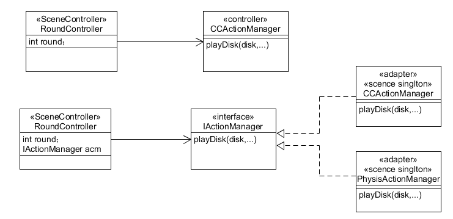
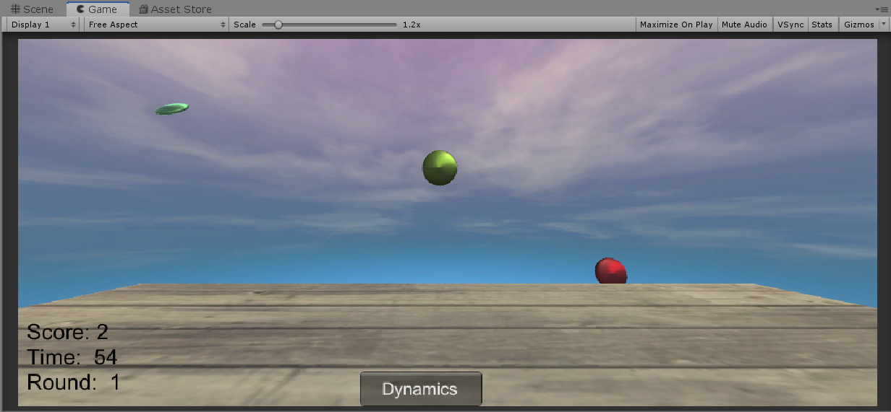

# Unity3d 打飞碟-物理运动版

[视频演示](https://www.bilibili.com/video/av71667504/)

## 题目要求

改进飞碟（Hit UFO）游戏：   

1. 按 *adapter模式* 设计图修改飞碟游戏；
2. 使它同时支持物理运动与运动学（变换）运动。


## Adapter 模式

* 运动学和动力学的物体运动存在区别。在 unity3d 中两种方式会产生不同的效果。使用 adapter 模式，使得游戏能支持两种方式的运动。

* uml 图变化如下，增加了一个接口和方法，场景控制器通过接口调用该方法，而具体的不同的动作控制类将实现该接口，方便场控的调用。

  <left></left>

## 实现

**效果如下**

<left></left>
* 和上一个版本的主要区别是添加了刚体后，飞碟碰撞会反弹。

主要写一下修改的地方。

**接口**

* 根据模式变化，需要修改接口。新加一个 `IActionManager` 接口。另外，在 `userAction` 中添加了 `getMode()`，`switchMode()` 方法，方便 GUI 获取当前模式和在动力学 (Dynamics) 模式，即物理运动，和运动学 (Kinematics) 模式之间进行切换。

```csharp
namespace Interfaces {
    public interface ISceneController {}

    public interface UserAction {
        void Hit(Vector3 pos);
        int getScore();
        int getRound();
        bool getMode();
        void stopGame();
        void Restart();
        void switchMode();
    }

    public enum SSActionEventType: int { Started, Completed}

    public interface ISSActionCallback {
        void SSActionCallback(SSAction source);
    }

    public interface IActionManager {
        void MoveDisk(Disk disk);
    }
}
```

**CCPhysisAction 的添加**

* 和 `CCMoveToAction` 一个道理，`CCPhysisAction` 也是一个继承了 `SSAction` 的具体的运动类。`CCMoveToAction` 是基于运动学的动作变换，是通过计算物体中心的运动方程，轨迹，位移，速度，旋转来直接变换游戏对象；`CCPhysisAction` 考虑了物体实际的重力和本身的形状，外部力对物体的影响，使游戏对象的运动更加逼真。
* 通过物理引擎更新的 `CCPhysisAction` 类需要使用 `FixedUpdate` （尽管这里只需要在 `start()` 中赋一次初始速度，无需在 FixedUpdate 中一直添加速度，但为了区别，我还是写了一个 `FixedUpdate`），所以在其继承的 `SSAction` 中添加了一个 `FixedUpdate` 虚函数，然后在 `CCPhysicAction` 中实现。而需要重写的 `Update` 函数空着即可。

```csharp
public class CCPhysisAction : SSAction {
    public float speedx, speedy, speedz;
    public float gravity = 0.0f;

    private CCPhysisAction() { }
    public static CCPhysisAction GetAction(Vector3 speed) {
        CCPhysisAction action = ScriptableObject.CreateInstance<CCPhysisAction>();
        action.speedx = speed.x;
        action.speedy = speed.y;
        action.speedz = speed.z;
        return action;
    }

    public override void Update() {}

    public override void FixedUpdate() {
        if (transform.position.y < -20) {
            Destroy(this.gameObject.GetComponent<Rigidbody>());
            destroy = true;
            callback.SSActionCallback(this);
        }
    }
    public override void Start() {
        if(!this.gameObject.GetComponent<Rigidbody>()) {
            this.gameObject.AddComponent<Rigidbody>();
        }
        this.gameObject.GetComponent<Rigidbody>().AddForce(new Vector3(speedx, speedy, speedz), ForceMode.VelocityChange);
    }
}
```

**SSAction 的修改**

* 添加了一个 `FixedUpdate` 虚函数，就本游戏而言，在继承了 `SSAction` 的 `CCMoveToAction` 中重写  `FixedUpdate`  时，空着即可。

```csharp
public class SSAction : ScriptableObject {
    public bool enable = true;
    public bool destroy = false;

    public GameObject gameObject;
    public Transform transform;
    public ISSActionCallback callback;

    protected SSAction() {}

    public virtual void Start() {
        throw new System.NotImplementedException();
    }

    public virtual void Update() {
        throw new System.NotImplementedException();
    }

    public virtual void FixedUpdate() {
        throw new System.NotImplementedException();
    }
}
```

**CCPhysisActionManager 的添加**

* 和 `CCActionManager` 相似，`CCPhysisActionManager` 是一个具体的动作管理器，只不过，在实现 `Adapter`接口 `IActionManager `的 `MoveDisk()`方法时，调用 `CCPhysisAction.GetAction()`，而非 `CCActionManager` 中的 `CCMoveToAction.GetAction()`。

```csharp
public class CCPhysisActionManager : SSActionManager, IActionManager, ISSActionCallback {
    public SSActionEventType Complete = SSActionEventType.Completed;
    int count = 0;

    public void MoveDisk(Disk disk) {
        ++count;
        Complete = SSActionEventType.Started;
        CCPhysisAction diskAction = CCPhysisAction.GetAction(disk.Speed);
        this.addAction(disk.gameObject, diskAction, this);
    }

    public void SSActionCallback(SSAction source) {
        --count;
        Complete = SSActionEventType.Completed;
        source.gameObject.SetActive(false);
    }
}

```

**SSActionManager 的修改**

* 因为 `SSActionManager` 通过 `SSAction` 使用具体的动作，而 `SSAction`中添加了一个 `FixedUpdate` 函数，所以只需要在`SSActionManager` 中的 `update` 函数中，增加对 `action` 的 `FixedUpdate()` 的调用，使得 `CCPhysisAction` 的 `FixedUpdate()` 生效。

```csharp
public class SSActionManager : MonoBehaviour {
    private Dictionary<int, SSAction> actions = new Dictionary<int, SSAction>();
    private List<SSAction> waitingAdd = new List<SSAction>();	
    private List<int> waitingDelete = new List<int>(); 

    protected void Update() {
        foreach (SSAction action in waitingAdd) {
            actions[action.GetInstanceID()] = action;
        }
        waitingAdd.Clear();

        foreach (KeyValuePair<int, SSAction> kv in actions) {
            SSAction action = kv.Value;
            if (action.destroy) {       // delete this action
                waitingDelete.Add(action.GetInstanceID());
            }
            else if (action.enable) {   // run this action
                action.Update();
                action.FixedUpdate();
            }
        }

        foreach (int key in waitingDelete) {
            SSAction action = actions[key];
            actions.Remove(key);
            Destroy(action);
        }
        waitingDelete.Clear();
    }

    /* add action to a gameobject */
    public void addAction(GameObject gameObject, SSAction action, ISSActionCallback manager) {
        action.gameObject = gameObject;
        action.transform = gameObject.transform;
        action.callback = manager;
        waitingAdd.Add(action);
        action.Start();
    }
}
```

**FirstController 的修改**

* `FirstController` 实现了 `UserAction` 接口，因为为了方便 GUI 与用户的交互，添加了 `switchMode()`，`getMode()` 方法，在此实现。同时，更换模式时，需要改变调用的具体的动作管理器，所以添加了一个 `reset()` 方法进行变换。

```csharp
public void switchMode() {
        usePhysic = !usePhysic;
        reset();
    }

    public bool getMode() {
        return usePhysic;
    }

    public void reset() {
        if (usePhysic) {
            actionManager = gameObject.AddComponent<CCPhysisActionManager>() as CCPhysisActionManager;
        }
        else {
            actionManager = gameObject.AddComponent<CCActionManager>() as CCActionManager;
        }
    }
```

