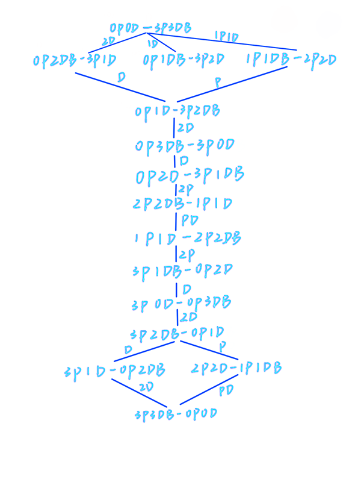

视频链接 [https://www.bilibili.com/video/av78422583/](https://www.bilibili.com/video/av78422583/)

**状态图**

<left></left>
* 师兄写的状态图其实很好，不过我觉得其中有些状态不需要，以及我的起始岸是在右边，就自己写了一个简写版的状态
  * `-` 左边的表示左岸状态， `-` 右边的表示右岸状态，`2P1DB` 表示该岸上有 2 个牧师，1 个魔鬼，船停在该案
  * 蓝色直线表示两种状态可以互相转换，但下面的状态才是离最终态更近的状态，所以智能帮助是向着下面的状态转换的